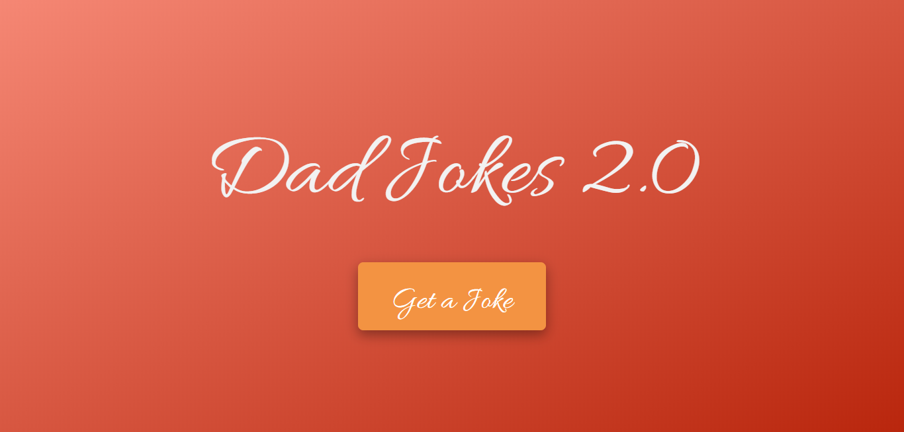
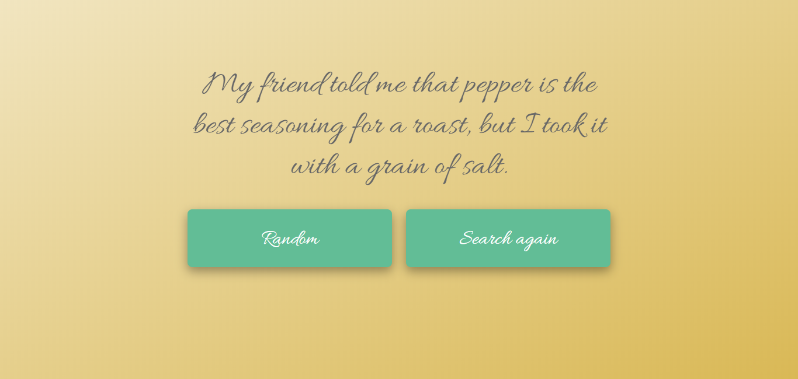

# DadJokesV2



This is the second and hopefully final version of DadJokes. This simple web based python app pulls jokes from [icanhazdadjoke](http://icanhazdadjoke.com) api and prints them to you. You can check it out [here](https://dadjokesv2.herokuapp.com/)



## Getting Started

This is really just a sample project on flask. If you wanna still mess around with stuff, clone the repo: https://github.com/emem365/DadJokesV2.git

### Prerequisites

All you need to get this project running is a virtual environment, and a few dependencies like
```
Python
flask library
```

### Installing

I won't go into details of creating a virtual environment. 
Install Flask inside the environment

```
pip install flask
```

To run the project, just run the deploy.py file

```
python deploy.py
```
The api requests are made through the file dadjokes.py

## Built With

* [Flask](https://flask.palletsprojects.com/en/1.1.x/) - The web framework used
* [Heroku](https://www.heroku.com/) - Deployed at
* [icanhazdadjokes](http://icanhazdadjoke.com) - API in use


## Authors

* **Madhur Maurya** - *Creator* - [emem365](https://github.com/emem365)


## License

This project is licensed under the MIT License - see the [LICENSE.md](LICENSE.md) file for details

## Acknowledgments

* A huge thanks to https://icanhazdadjoke.com/ whose free api we use :)
